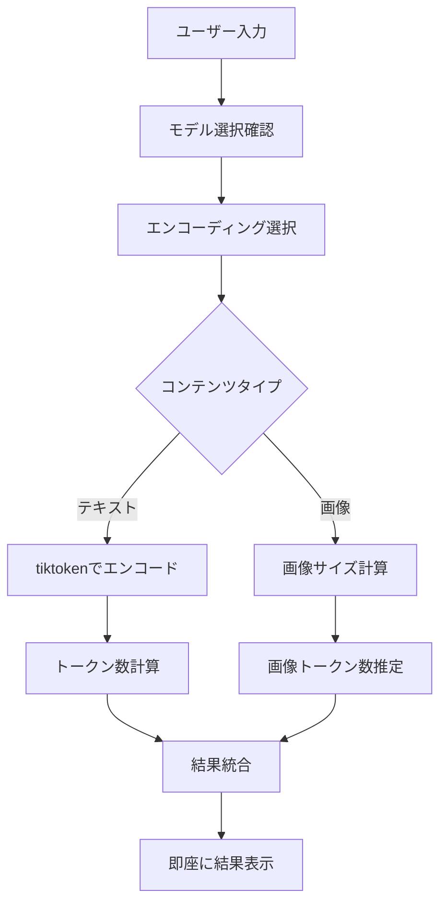
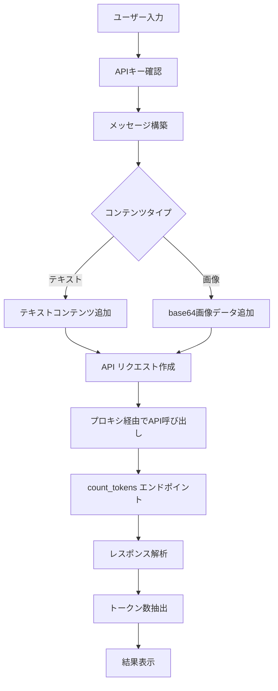
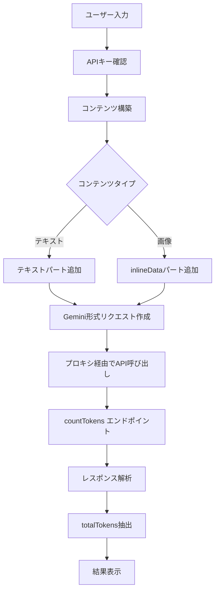

# AI Token Counter

複数のAIプロバイダ（Anthropic、OpenAI、Gemini）のトークン数をカウントするWebアプリケーションです。TypeScript、Svelte、Material UIを使用して構築されています。

## 機能

- **複数プロバイダ対応**: Anthropic、OpenAI、Google Geminiから選択可能
- **モデル選択**: 選択したプロバイダに応じてモデルを選択
- **テキスト入力**: トークンカウントしたいテキストを入力
- **画像入力**: 画像ファイルのアップロード（対応モデルのみ）
- **高速トークンカウント**: 
  - Anthropic: API経由でリアルタイム取得
  - OpenAI: tiktokenライブラリによるローカル計算（APIキー不要）
  - Gemini: API経由でリアルタイム取得
- **結果表示**: 入力トークン数を表示
- **エラーハンドリング**: APIエラーやネットワークエラーの適切な処理
- **レスポンシブデザイン**: モバイル対応

## 技術スタック

- **フロントエンド**: Svelte 4 + TypeScript
- **UIライブラリ**: Svelte Material UI (SMUI)
- **ビルドツール**: Vite + vite-plugin-wasm
- **状態管理**: Svelte Store
- **トークナイザー**: tiktoken（OpenAI用）
- **API**: Anthropic API、Gemini API

## セットアップ

### 1. 依存関係のインストール

```bash
npm install
```

### 2. 環境変数の設定

`.env.example`を`.env`にコピーして、必要なAPIキーを設定してください。

```bash
cp .env.example .env
```

`.env`ファイルを編集：

```env
# Anthropic API Key（必要に応じて）
VITE_ANTHROPIC_API_KEY=your_anthropic_api_key_here

# Gemini API Key（必要に応じて）
VITE_GEMINI_API_KEY=your_gemini_api_key_here

# OpenAI用のAPIキーは不要（tiktokenによるローカル計算）
```

APIキーの取得方法：
- Anthropic: [Anthropic Console](https://console.anthropic.com/)
- Gemini: [Google AI Studio](https://aistudio.google.com/app/apikey)

### 3. 開発サーバーの起動

```bash
npm run dev
```

ブラウザで `http://localhost:5173` にアクセスしてください。

## 使用方法

1. **プロバイダを選択**: ドロップダウンからAIプロバイダを選択
2. **モデルを選択**: 選択したプロバイダのモデル一覧から選択
3. **コンテンツを入力**: 
   - テキストを入力エリアに入力
   - 画像ファイルをアップロード（対応モデルのみ）
4. **カウント実行**: 「トークン数をカウント」ボタンをクリック
5. **結果確認**: 入力トークン数が表示されます

## プロジェクト構造

```
tokenizer/
├── src/
│   ├── lib/
│   │   ├── types/           # 型定義
│   │   ├── services/        # APIサービス
│   │   │   ├── anthropicService.ts
│   │   │   ├── openaiService.ts
│   │   │   ├── geminiService.ts
│   │   │   └── providerService.ts
│   │   ├── stores/          # 状態管理
│   │   └── utils/           # ユーティリティ
│   ├── components/          # Svelteコンポーネント
│   ├── App.svelte          # メインアプリケーション
│   └── main.ts             # エントリーポイント
├── index.html              # HTMLテンプレート
├── package.json
├── tsconfig.json
├── vite.config.js
└── README.md
```

## 対応モデル

### Anthropic
- Claude Opus 4
- Claude Sonnet 4
- Claude Sonnet 3.7
- Claude 3.5 Sonnet
- Claude 3.5 Haiku
- Claude 3 Opus
- Claude 3 Haiku

### OpenAI（tiktokenによるローカル計算）
- GPT-4o
- GPT-4o Mini
- GPT-4 Turbo
- GPT-4
- GPT-3.5 Turbo

### Google
- Gemini 2.0 Flash
- Gemini 1.5 Pro
- Gemini 1.5 Flash

## トークン数取得処理の流れ

### OpenAI（ローカル計算）



**処理詳細:**
1. **モデル判定**: GPT-4o系 → `o200k_base`、その他 → `cl100k_base`
2. **テキスト処理**: tiktokenライブラリでローカルエンコード
3. **画像処理**: ファイルサイズから概算計算（基本85トークン + サイズ別追加）
4. **メモリ管理**: エンコーディングオブジェクトの適切な解放
5. **結果返却**: 瞬時にトークン数を返却

### Anthropic（API経由）



**処理詳細:**
1. **認証**: 環境変数からAPIキー取得
2. **データ変換**: 画像をbase64エンコード、Anthropic形式に変換
3. **API呼び出し**: プロキシ経由でcount_tokensエンドポイントにPOST
4. **エラーハンドリング**: ネットワークエラー、APIエラーの適切な処理
5. **結果解析**: `input_tokens`フィールドからトークン数を取得

### Gemini（API経由）



**処理詳細:**
1. **認証**: 環境変数からAPIキー取得、URLパラメータとして送信
2. **データ構造**: Gemini独自の`contents`配列形式に変換
3. **画像処理**: `inlineData`形式でmimeTypeとbase64データを設定
4. **API呼び出し**: プロキシ経由でcountTokensエンドポイントにPOST
5. **結果解析**: `totalTokens`フィールドからトークン数を取得

## 特徴

### OpenAIのローカル計算
- **APIキー不要**: tiktokenライブラリによるクライアントサイド計算
- **高速**: ネットワーク通信なしで瞬時に結果を取得
- **正確**: OpenAI公式のトークナイザーと同じアルゴリズム
- **プライバシー**: テキストデータが外部に送信されない
- **コスト削減**: API使用料金が発生しない
- **オフライン対応**: インターネット接続不要

### AnthropicとGeminiのAPI経由処理
- **リアルタイム**: 最新のAPI仕様に基づく正確な計算
- **公式サポート**: 各プロバイダの公式APIを使用
- **マルチモーダル**: テキストと画像の両方に対応
- **プロキシ対応**: CORS問題を回避する設定

### 画像対応
- マルチモーダルモデルでの画像トークンカウント
- ローカルファイルのアップロード
- 画像プレビュー機能
- 各プロバイダの画像形式に対応

## ビルド

本番用ビルドを作成：

```bash
npm run build
```

ビルドされたファイルは`dist/`フォルダに出力されます。

## プレビュー

本番ビルドをローカルでプレビュー：

```bash
npm run preview
```

## 開発

### コーディング規約

プロジェクトでは以下のコーディング規約に従っています：

- 関数名: camelCase
- クラス名: PascalCase
- 定数: UPPER_SNAKE_CASE
- ファイル名: camelCase（.ts）、PascalCase（.svelte）
- 関数は20行以内、引数は3つ以下
- 全ての非同期関数でtry-catchを使用
- JSDoc形式のコメント

### 型チェック

TypeScriptの型チェックを実行：

```bash
npm run check
```

## ライセンス

MIT License

## 貢献

プルリクエストやイシューの報告を歓迎します。

## 注意事項

- AnthropicとGeminiを使用する場合はAPIキーが必要です
- APIの使用量に応じて料金が発生する場合があります
- OpenAIはローカル計算のためAPIキー不要です
- 最大入力文字数は100,000文字です
- 画像は対応モデルでのみ使用可能です
